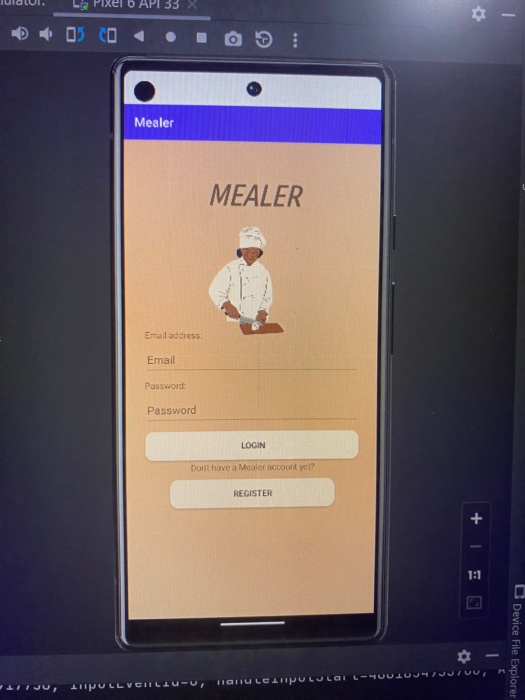
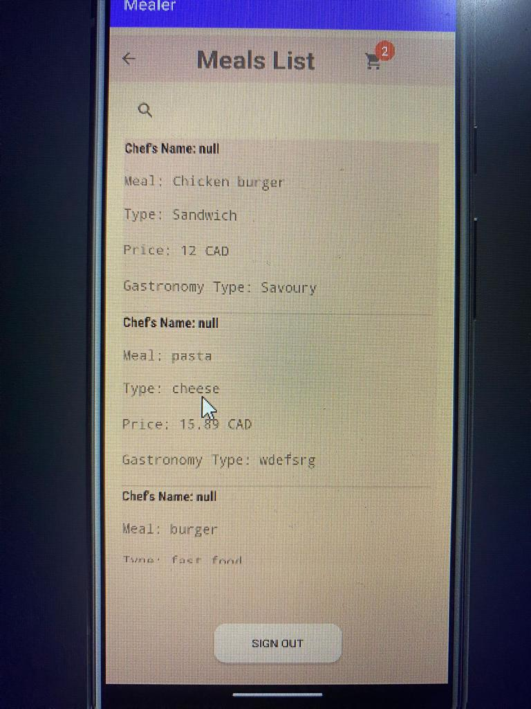
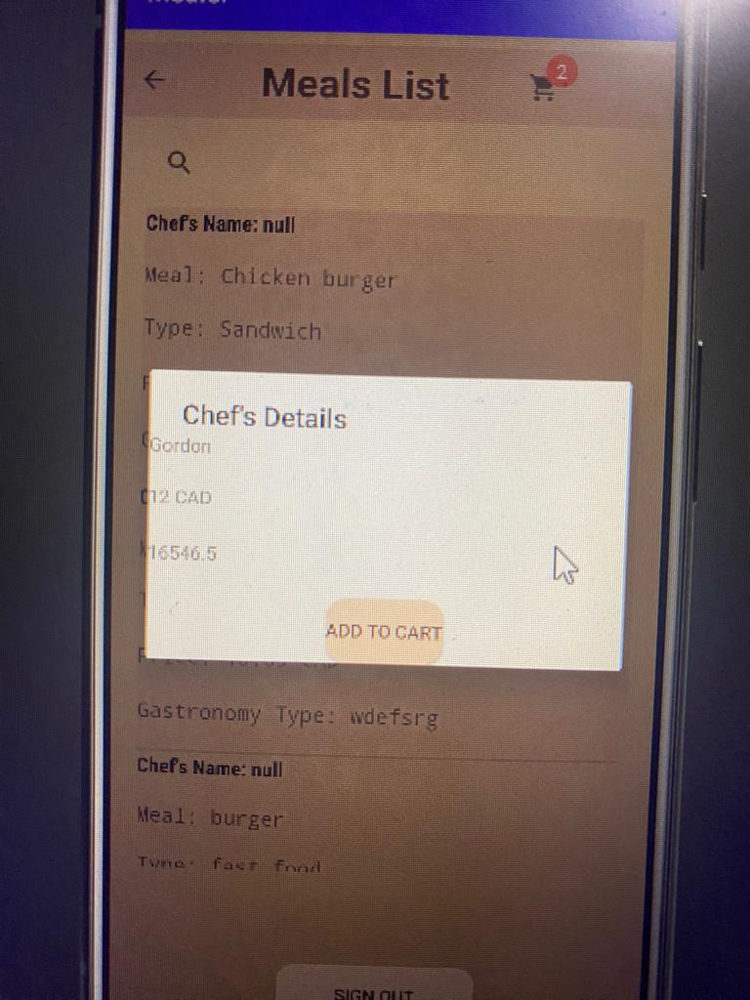
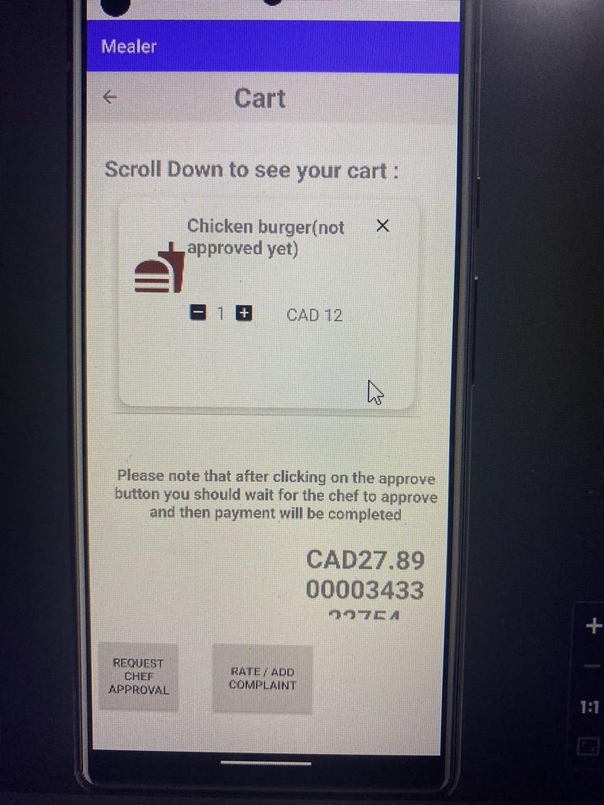
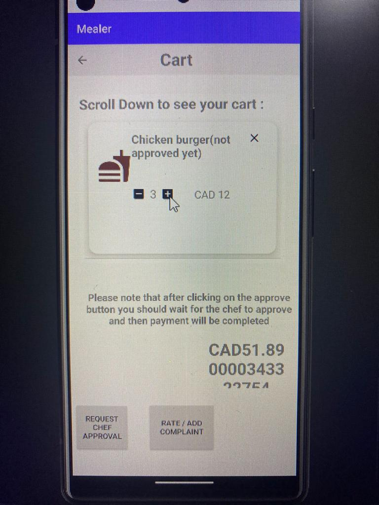
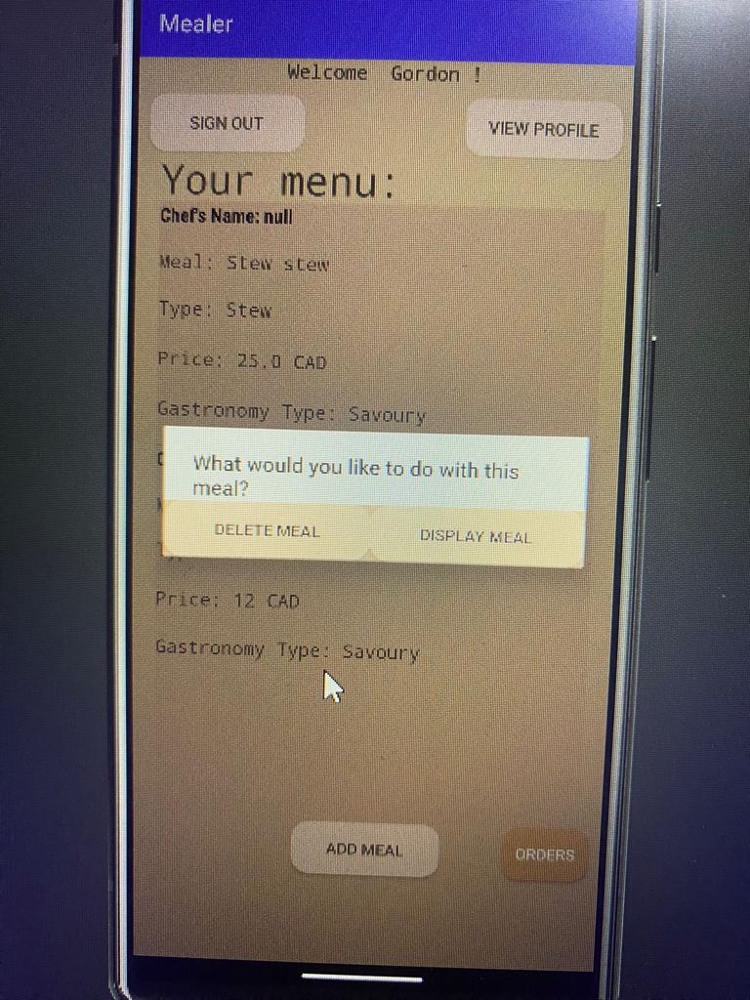
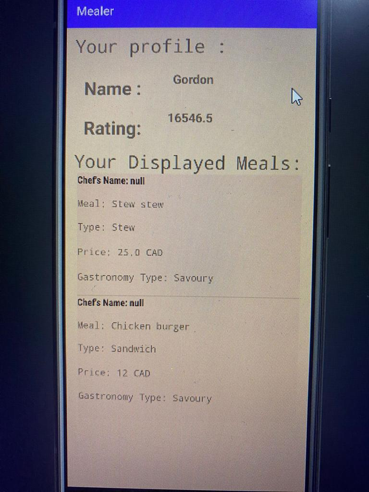
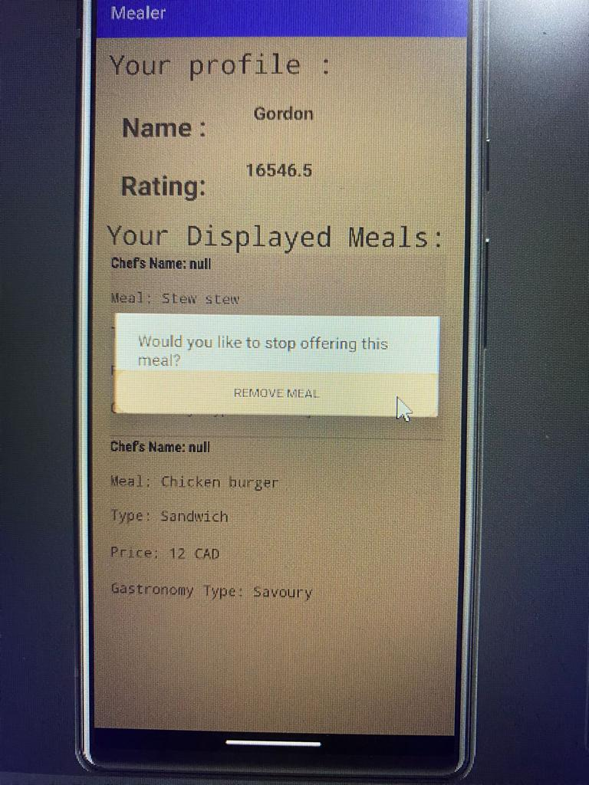

## Mealer
An Android application. The pupose of this application is to let the users order food and pick up their food from the chef's location.  
Also, the chef can add, edit, remove, display or not his meals.  

### About the project

Looking at the project from the client side ->   
1. The following photo is the first page the client will see after he logs in. It is the meals list  

 

2. The following photo is what the client will see if he choses a meal  

 

3. After choosing a meal, the client can access his cart and see the total  

 

4. The client can also add as many dishes of the same meal as he wishes to his cart and the total will be automatically calculated.  

 

Now from the chef's side -->

5. The chef will be able to add and see all of his meals. Also, the chef can also choose to display or not his meals  

 

6. The chef can see his diplayed and the ones that he is offering.

 

7. The chef can also remove his meal from the list by undisplaying it

 

# Installation 
To install this application, you can fork it from Github or download it as a zip file. 
You can run it on  *Android Studio*
*Download as a zip file*  
> If you decide to download the application as a zip file, you should add your **local.properties** file to configure the app on your device.   

# Note 
This project is in progress. Please feel free to send any comment, a problem you faced or even a random question.  
Contact me on Linkedin: www.linkedin.com/in/hibatant  

# Contributors
https://github.com/mostefaiii   
https://github.com/bAnalya      
https://github.com/Manaalm20    
https://github.com/carrot03     
